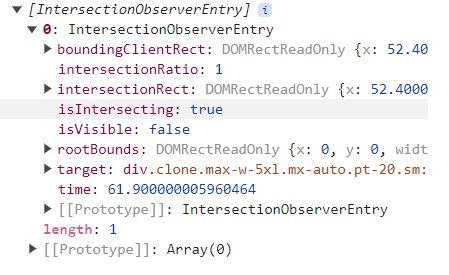

# Learn Intersection Observer

also known as the `INFINITE SCROLLING`

Reference: https://www.youtube.com/watch?v=2IbRtjez6ag

Intersection Observer is an amazing tool in JavaScript
that allows you to easily and efficiently do pretty much anything based on the visibility of elements.

This is perfect for scroll animations, lazy loading images, infinite scroll, and much more.
Also, Intersection Observer is incredibly performant and flexible which makes it by far the best approach.

[Jump here for the actual topic][main]

[main]: #intersection-observer

## Contents

1. [Intersection Observer](#intersection-observer)
2. [Observer to animate targets](#observer-to-animate-targets)
3. [Unobserving targets](#unobserving-targets)
4. [Lazy Loading](#lazy-loading)

## Getting Started

**This section is not related to the topic at all,
but rather showing how this project was scaffold from zero**. [Jump here for the main topic][main]

1. `npm init -y`
2. `npm install -D tailwindcss`
3. `npx tailwindcss init`
4. Configure template paths:

`tailwind.config.js`

```js
/** @type {import('tailwindcss').Config} */
module.exports = {
  content: ['./src/**/*.{html,js}'],
  theme: {
    extend: {},
  },
  plugins: [],
};
```

5. Add `src/input.css`

```css
@tailwind base;
@tailwind components;
@tailwind utilities;
```

6. Update `package.json` scripts

```json
{
  "scripts": {
    "start": "tailwindcss -i ./src/input.css -o ./src/output.css --watch"
  }
}
```

7. Insert stylesheet in your HTML

```html
<link href="./output.css" rel="stylesheet" />
```

## Intersection Observer

```js
const clones = document.querySelectorAll('.clone');

// * Initialization
const observer = new IntersectionObserver(callback);

// * Specify a DOM to observe
observer.observe(clones[0]);

// * Specifying multiple DOM to observe
// clones.forEach((clone) => observer.observe(clone));

/**
 * * Tell observer what to do
 * @param {IntersectionObserverEntry[]} entries
 */
function callback(entries) {
  console.log(entries);
}
```



## Observer to animate targets

Let's say we want to tell the **observer** to animate the targets via CSS classes.

- **Given** animation which keyframes is to simply slide up
- **When** `isIntersecting` is true
- **Then** toggle class for animation

```html
<!-- 

  Append the following (animation) classes after the '...'

  entering: 
    - from: opacity-0 blur-md
    - animation: 
        - animate-slide-up

-->
<div
  class="clone max-w-5xl mx-auto pt-20 sm:pt-24 lg:pt-32 ... opacity-0 blur-md"></div>
```

```js
function callback(entries) {
  entries.forEach((entry) => {
    entry.target.classList.toggle('animate-slide-up', entry.isIntersecting);
  });
}
```

You should now notice that it's already animating even the DOM comes into view when the
smallest margin or pixel of the DOM becomes visible.

We only want to animate the DOM ONLY when the entire element is visible.

This is where the `IntersectionObserver` **options** comes very useful.

```js
/** @type {IntersectionObserverInit} */
const options = {
    threshold: 1 // only when 100% of the element is visible
}

// * Initialization
const observer = new IntersectionObserver(callback, options);

...
```

You would notice that when we scroll down, the **observer** will toggle or remove the class
from our element as soon as it's not 100% visible in the view.

Since our `.clone` element is too big, that its 100% body is not immediately covered in the view,
we can simply adjust the `threshold` accordingly based on the target's size. Maybe around `0.8` threshold.

## Unobserving targets

You would notice that the observe reapplies the classes/animation on the targets
as soon as we scroll up and down.

There are use-cases that once the element has been displayed, we don't want it to disappear.

This is where the `observer.unobserve()` becomes handy.

```js
function callback(entries) {
  entries.forEach((entry) => {
    entry.target.classList.toggle('animate-slide-up', entry.isIntersecting);

    if (entry.isIntersecting) {
      observer.unobserve(entry.target);
    }
  });
}
```

Now, when you try to scroll away, the DOM element will be completely visible.

## Lazy Loading

You may now have noticed that in most cases of social media apps, it's like an infinite scroll.
But the contents are not all loaded in view, otherwise, it's a huge data to download.

We can apply that concept using the `IntersectionObserver`

First, we'll create a new `IntersectionObserver` to observe the last clone element.
Only when last clone is visible, then we'll add new more clones.

```js
const main = document.querySelector('main');
const prime = document.querySelector('main div:first-child');

const lastCloneObserver = new IntersectionObserver((entries) => {
  const lastClone = entries[0];

  if (!lastClone.isIntersecting) {
    return;
  }

  // Add 10 new clones
  addNewClones();

  // Since we added new clones, then ...
  // ! It is important to unobserve that target since it's not the last clone anymore
  lastCloneObserver.unobserve(lastClone.target);

  // * Observe the "new" last clone
  lastCloneObserver.observe(document.querySelector('.clone:last-child'));
});

// * Observe the "current" last clone
lastCloneObserver.observe(document.querySelector('.clone:last-child'));

function addNewClones() {
  for (let i = 0; i < 10; i++) {
    const clone = prime.cloneNode(true);
    observer.observe(clone);
    main.appendChild(clone);
  }
}
```

### Advancing API calls

Now with the real API or network requests, it may take a little bit of time.
SO this is where the `options.rootMargin` comes into play.

```js
/** @type {IntersectionObserverInit} */
const options = {
  rootMargin: '100px', // advance calling network requests before 100px of the last child comes into view
};

const lastCloneObserver = new IntersectionObserver(callback, options);

...
```
